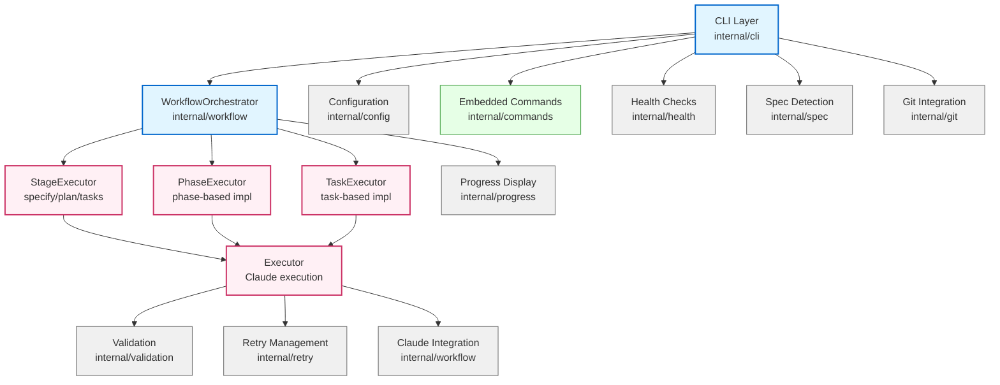
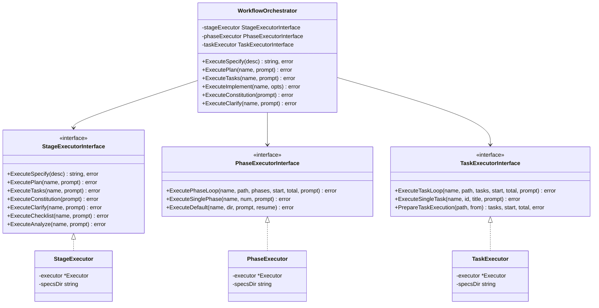
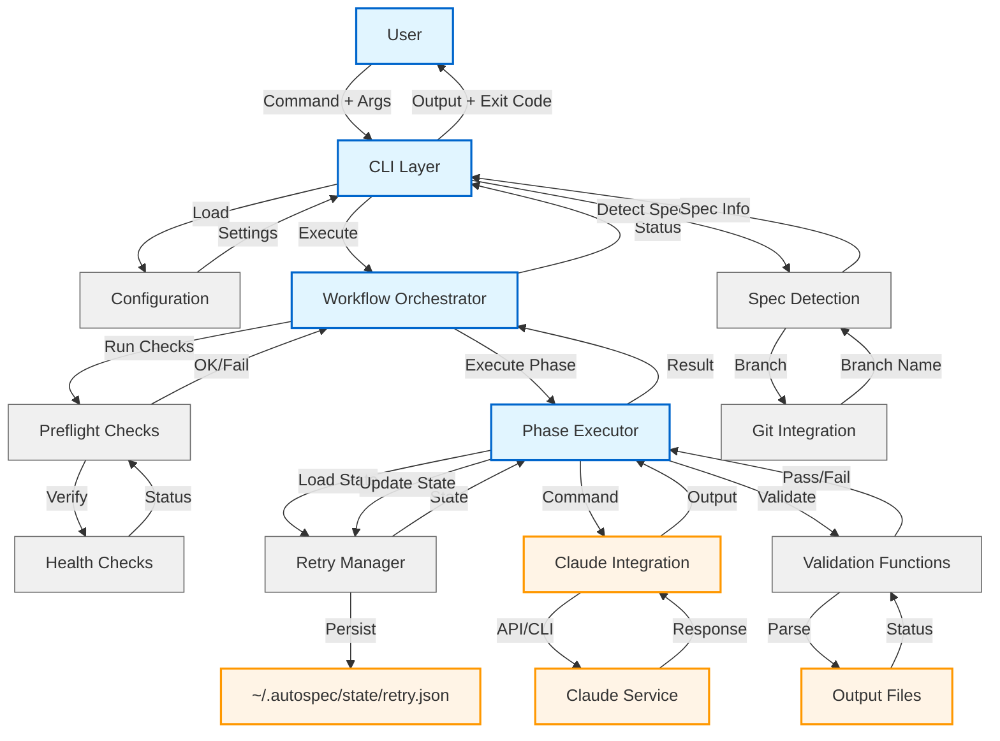
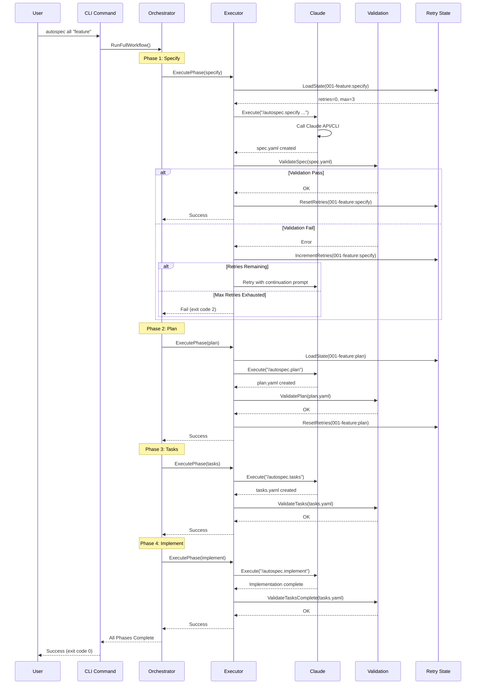
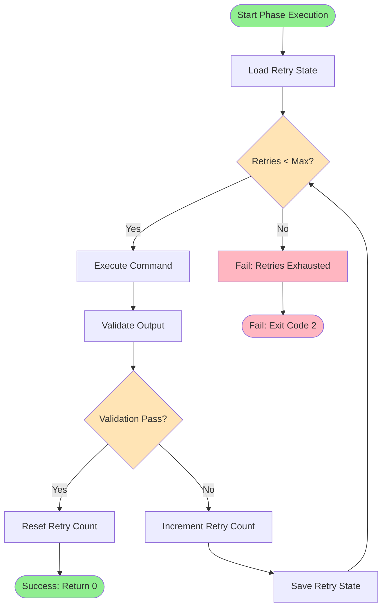

# Architecture Overview

Deep dive into autospec's system design, component structure, and execution patterns.

## Table of Contents

- [Component Overview](#component-overview)
- [System Architecture](#system-architecture)
- [Package Structure](#package-structure)
- [Execution Flow](#execution-flow)
- [Key Patterns](#key-patterns)
- [Integration Points](#integration-points)

## Component Overview

autospec is built as a modular Go application with clear separation of concerns across several packages:



### 1. CLI Layer (internal/cli/)

User-facing Cobra commands (internal/cli/root.go:1): Parse args, load config, invoke workflows, display results

### 2. Workflow Orchestration (internal/workflow/)

Multi-stage execution with validation and retry. The workflow package uses a layered architecture:

- **WorkflowOrchestrator** (orchestrator.go): High-level coordination, delegates to specialized executors
- **StageExecutor** (stage_executor.go): Handles specify, plan, tasks, and auxiliary stages (constitution, clarify, etc.)
- **PhaseExecutor** (phase_executor.go): Handles phase-based implementation with context files
- **TaskExecutor** (task_executor.go): Handles individual task execution with dependency validation
- **Executor** (executor.go): Low-level Claude command execution with retry logic

### Executor Architecture

The workflow package uses a Strategy pattern with specialized executors:



This architecture provides:
- **Separation of Concerns**: Each executor handles one execution strategy
- **Testability**: Interfaces enable mock-based unit testing
- **Single Responsibility**: Orchestrator coordinates, executors execute

### 3. Configuration (internal/config/)

Hierarchical config loading with koanf (internal/config/config.go:1): Priority Env > Local > Global > Defaults

Key files:
- `config.go`: `Configuration` struct with `koanf` tags, `ToMap()` for serialization
- `schema.go`: `KnownKeys` registry for validation, type info, and `config sync`
- `defaults.go`: Default values for all config fields

The `ToMap()` method uses reflection to automatically include all `koanf`-tagged fields in `config show` output, eliminating manual map maintenance.

### 4. Validation (internal/validation/)

Fast validation (<10ms) for artifacts (internal/validation/validation.go:1): Validate file existence, parse tasks, generate prompts

### 5. Retry Management (internal/retry/)

Persistent retry state (internal/retry/retry.go:1): Track retries per spec:phase in `~/.autospec/state/retry.json`

### 6. Spec Detection (internal/spec/)

Auto-detect current spec (internal/spec/spec.go:1): Check git branch pattern or most recent specs/ directory

### 7. Git Integration (internal/git/)

Git helpers (internal/git/git.go:1): Check repo status, get branch name

### 8. Health Checks (internal/health/)

Dependency verification (internal/health/health.go:1): Verify Claude CLI, check directory access, validate config

### 9. Progress Display (internal/progress/)

Real-time feedback (internal/progress/display.go:1): Spinner indicators for long-running operations

### 10. Embedded Commands (internal/commands/)

Slash command templates embedded in binary (internal/commands/embed.go:1): Install to `.claude/commands/` during `autospec init`

## System Architecture

High-level architecture showing data flow and component interactions:



## Package Structure

Internal package organization:

```
internal/
├── cli/          # Cobra CLI commands
│   ├── stages/   # Stage commands (specify, plan, tasks, implement)
│   ├── config/   # Configuration commands (init, config, migrate, doctor)
│   ├── util/     # Utility commands (status, history, version, clean, view)
│   ├── admin/    # Admin commands (commands, completion, uninstall)
│   ├── worktree/ # Worktree management commands (create, list, remove, prune)
│   └── shared/   # Shared types and constants
├── workflow/     # Workflow orchestration and execution
│   ├── orchestrator.go    # WorkflowOrchestrator - high-level coordination
│   ├── stage_executor.go  # StageExecutor - specify/plan/tasks/constitution/clarify/etc.
│   ├── phase_executor.go  # PhaseExecutor - phase-based implementation
│   ├── task_executor.go   # TaskExecutor - task-based implementation
│   ├── executor.go        # Executor - Claude command execution with retry
│   ├── interfaces.go      # Interface definitions for dependency injection
│   ├── preflight.go       # PreflightChecks - dependency verification
│   ├── validators.go      # Stage validation functions
│   └── context.go         # Phase context file generation
├── config/       # Config loading (koanf), defaults, XDG paths, YAML validation
├── commands/     # Embedded slash command templates (.md files)
├── validation/   # File validation, task parsing, prompt generation
├── retry/        # Persistent retry state management
├── spec/         # Spec detection (git branch, directory scan)
├── git/          # Git helpers (branch name, repo status)
├── agent/        # Agent context file management (update CLAUDE.md, etc.)
├── cliagent/     # CLI agent abstraction and Configurator interface
├── claude/       # Claude-specific integration
├── health/       # Dependency verification
├── progress/     # Spinner display for operations
├── yaml/         # YAML parsing utilities
├── clean/        # Project cleanup functions
├── uninstall/    # System uninstall functions
├── errors/       # Custom error types
├── lifecycle/    # Command lifecycle wrapper for notifications and history
├── notify/       # Notification system (sound, visual)
├── history/      # Command history persistence
├── completion/   # Shell completion generation
├── worktree/     # Git worktree management logic
├── dag/          # DAG support for parallel task execution
└── testutil/     # Test utilities and helpers
```

## Execution Flow

### Complete Workflow Execution

Sequence diagram showing full workflow execution with retry logic:



### Phase Execution with Retry

Detailed flowchart showing retry logic within a single phase:



## Key Patterns

### 1. Retry Pattern

**Implementation**: internal/workflow/executor.go:50

**How it works**:
```go
func (e *Executor) ExecutePhase(specName, phase, command string, validateFn func() error) error {
    state := e.retryManager.LoadState(specName, phase)

    for state.Count < state.MaxRetries {
        err := e.executeCommand(command)
        if err != nil {
            state.Count++
            e.retryManager.SaveState(state)
            continue
        }

        err = validateFn()
        if err == nil {
            e.retryManager.ResetRetries(specName, phase)
            return nil
        }

        state.Count++
        e.retryManager.SaveState(state)
    }

    return ErrRetriesExhausted
}
```

**Benefits**:
- Resilient to transient failures
- Persistent state across executions
- Configurable retry limits
- Clear failure reporting

### 2. Configuration Layering

**Implementation**: internal/config/config.go:1

**Priority Order**:
1. Environment variables (`AUTOSPEC_*`)
2. Local config (`.autospec/config.yml`)
3. Global config (`~/.config/autospec/config.yml`)
4. Defaults (hardcoded)

**Example**:
```bash
# Priority 1: Environment variable
export AUTOSPEC_MAX_RETRIES=5

# Priority 2: Local config
echo 'max_retries: 0' > .autospec/config.yml

# Priority 3: Global config
echo 'max_retries: 2' > ~/.config/autospec/config.yml

# Result: max_retries = 5 (environment wins)
```

### 3. Spec Detection

**Implementation**: internal/spec/spec.go:1

**Strategy**:
```go
func DetectCurrentSpec() (*SpecMetadata, error) {
    // Strategy 1: Git branch name
    branch := git.CurrentBranch()
    if matches := specPattern.FindStringSubmatch(branch); matches != nil {
        return parseSpecFromBranch(matches), nil
    }

    // Strategy 2: Most recent specs/ directory
    dirs := findSpecDirs("./specs")
    mostRecent := sortByModTime(dirs)[0]
    return parseSpecFromDir(mostRecent), nil
}
```

**Benefits**:
- Zero friction for users
- Works with git workflows
- Falls back to directory scan

### 4. Exit Code Conventions

**Implementation**: All commands follow consistent exit codes

| Code | Meaning | When Used |
|------|---------|-----------|
| 0 | Success | All operations completed successfully |
| 1 | Validation failed | Output artifact validation failed (retryable) |
| 2 | Retry limit exhausted | Max retries reached without success |
| 3 | Invalid arguments | User provided invalid command arguments |
| 4 | Missing dependencies | Required dependencies (claude, git) not found |
| 5 | Command timeout | Operation exceeded configured timeout |

**Benefits**:
- Scriptable workflows
- CI/CD integration
- Clear error identification

## Integration Points

### Claude Integration

**Methods**:
1. **Preset Mode** (default): Use a registered agent preset
2. **Custom Mode**: User-defined command with `{{PROMPT}}` placeholder

**Configuration**:
```yaml
# Using a preset
agent_preset: claude

# Or custom configuration
custom_agent:
  command: sh
  args:
    - -c
    - "claude -p {{PROMPT}} | process-output"
```

**Prompt Injection**:
All phase commands support optional guidance text:
```bash
autospec plan "Focus on security best practices"
# Executes: claude -p "/autospec.plan \"Focus on security best practices\""
```

### File System

**Directories**:
- `./specs/NNN-feature-name/`: Feature specifications and artifacts
- `~/.config/autospec/`: Global configuration (XDG compliant)
- `~/.autospec/state/`: State directory
- `.autospec/`: Local project configuration

**Files**:
- `spec.yaml`: Feature specification
- `plan.yaml`: Technical plan
- `tasks.yaml`: Task breakdown
- `~/.config/autospec/config.yml`: Global configuration
- `.autospec/config.yml`: Local configuration
- `~/.autospec/state/retry.json`: Retry state

### External Tools

**Required**:
- Claude CLI: For workflow execution
- Git (optional): For branch-based spec detection

## Performance Characteristics

**Design Goals**:
- Sub-second validation checks (<1s)
- Validation functions <10ms
- Minimal memory footprint
- Fast startup time

**Benchmarks**:
- File validation: ~1-2ms (internal/validation/validation_bench_test.go)
- Task parsing: ~5-8ms (internal/validation/tasks_test.go)
- Config loading: ~10-15ms (internal/config/config.go)

## Error Handling

**Philosophy**: Fail fast, fail clearly, provide actionable guidance

**Patterns**:
1. **Validation Errors**: Include file paths, expected vs actual, retry suggestions
2. **Dependency Errors**: Include installation/fix instructions
3. **Timeout Errors**: Include timeout duration, config hints
4. **Retry Exhausted**: Include last error, retry count, state file location

**Example**:
```
Error: Validation failed: spec file not found
Expected: specs/001-dark-mode/spec.yaml
Retry: 2/3 (state: ~/.autospec/state/retry.json)
Hint: Run 'autospec specify "feature description"' to create spec
```

## Extension Points

Areas designed for future extension:

1. **Custom Validators**: Add new validation functions in internal/validation/
2. **Additional Commands**: Add new CLI commands in internal/cli/
3. **Alternative Executors**: Implement ClaudeExecutor interface for new backends
4. **Custom Health Checks**: Extend health check framework
5. **Progress Reporters**: Implement alternative progress display formats

## Architecture Refactoring Roadmap

Identified refactoring opportunities organized by priority and dependencies. Each issue has a comprehensive spec in `.dev/tasks/`.

### Execution Order

**Wave 1: Template/Doc Changes (Low Risk, Immediate Benefit)**

| # | Issue | Priority | Effort | Token Savings |
|---|-------|----------|--------|---------------|
| 1 | File Reading Discipline | CRITICAL | Low | 30-50K/session |
| 2 | Context Efficiency Guidance | HIGH | Low | 10-20K/session |
| 3 | Sandbox Documentation | MEDIUM | Low | 2-5K/session |

**Wave 2: Schema/Feature Changes**

| # | Issue | Priority | Effort | Description |
|---|-------|----------|--------|-------------|
| 4 | Phase Context Metadata | HIGH | Medium | Add _context_meta to phase files |
| 5 | Large File Handling | MEDIUM | Medium | Add _implementation_hints to tasks.yaml |
| 6 | Test Infrastructure Caching | MEDIUM | Medium | New notes.yaml artifact |

**Wave 3: DI Foundation (Before Major Refactoring)**

| # | Issue | Priority | Effort | Description |
|---|-------|----------|--------|-------------|
| 7 | Dependency Injection | MEDIUM | Medium | Interfaces for testability |

**Wave 4: Core Refactoring (Can Run in Parallel)**

| # | Issue | Priority | Effort | Description |
|---|-------|----------|--------|-------------|
| 8 | Executor Separation | HIGH | Medium | Split display/notify/retry from Executor |
| 9 | CLI Subpackages | MEDIUM | Low | Organize 47 CLI files into subpackages |

**Wave 5: Major Refactoring**

| # | Issue | Priority | Effort | Dependencies |
|---|-------|----------|--------|--------------|
| 10 | WorkflowOrchestrator Split | HIGH | High | arch-4 |
| 11 | Strategy Pattern | MEDIUM | Medium | arch-1 |

**Wave 6: Polish (Can Run in Parallel)**

| # | Issue | Priority | Effort |
|---|-------|----------|--------|
| 12 | Validation Schema Split | LOW | Low |
| 13 | Type-Safe Enums | LOW | Low |
| 14 | Structured Logging | LOW | Low |
| 15 | Validator Composition | LOW | Low |

### Quick Commands

**Wave 1 - Template/Doc Changes:**
```bash
# 1. File Reading Discipline (CRITICAL)
autospec specify "$(cat .dev/tasks/fixes/fix-1-file-reading-discipline.md)"

# 2. Context Efficiency Guidance
autospec specify "$(cat .dev/tasks/fixes/fix-3-context-efficiency.md)"

# 3. Sandbox Documentation
autospec specify "$(cat .dev/tasks/fixes/fix-4-sandbox-documentation.md)"
```

**Wave 2 - Schema/Feature Changes:**
```bash
# 4. Phase Context Metadata
autospec specify "$(cat .dev/tasks/fixes/fix-2-phase-context-metadata.md)"

# 5. Large File Handling
autospec specify "$(cat .dev/tasks/fixes/fix-5-large-file-handling.md)"

# 6. Test Infrastructure Caching
autospec specify "$(cat .dev/tasks/fixes/fix-6-test-infrastructure-caching.md)"
```

**Wave 3 - DI Foundation:**
```bash
# 7. Dependency Injection
autospec specify "$(cat .dev/tasks/arch/arch-4-dependency-injection.md)"
```

**Wave 4 - Core Refactoring:**
```bash
# 8. Executor Separation
autospec specify "$(cat .dev/tasks/arch/arch-2-executor-separation.md)"

# 9. CLI Subpackages
autospec specify "$(cat .dev/tasks/arch/arch-3-cli-subpackages.md)"
```

**Wave 5 - Major Refactoring:**
```bash
# 10. WorkflowOrchestrator Split
autospec specify "$(cat .dev/tasks/arch/arch-1-workflow-orchestrator-split.md)"

# 11. Strategy Pattern
autospec specify "$(cat .dev/tasks/arch/arch-5-strategy-pattern.md)"
```

**Wave 6 - Polish:**
```bash
# 12. Validation Schema Split
autospec specify "$(cat .dev/tasks/arch/arch-6-validation-schema-split.md)"

# 13. Type-Safe Enums
autospec specify "$(cat .dev/tasks/arch/arch-7-type-safe-enums.md)"

# 14. Structured Logging
autospec specify "$(cat .dev/tasks/arch/arch-8-structured-logging.md)"

# 15. Validator Composition
autospec specify "$(cat .dev/tasks/arch/arch-9-validator-composition.md)"
```

### Full Workflow Example

Run full autospec flow on any issue:
```bash
# Specify → Plan → Tasks (preparation)
autospec prep "$(cat .dev/tasks/fixes/fix-1-file-reading-discipline.md)"

# Then implement
autospec implement --phases
```

Or run everything in one shot:
```bash
autospec run -a "$(cat .dev/tasks/fixes/fix-1-file-reading-discipline.md)"
```

## Further Reading

- **[Quick Start Guide](../quickstart.md)**: Get started with basic usage
- **[Command Reference](../reference.md)**: Complete command and configuration documentation
- **[Troubleshooting](../troubleshooting.md)**: Common issues and solutions
- **[CLAUDE.md](../../CLAUDE.md)**: Detailed development guidelines for contributors
- **[Architecture Decoupling Analysis](../../.dev/tasks/architecture-decoupling-analysis.md)**: Full analysis document
