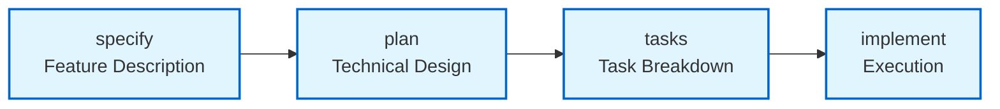

# Quick Start Guide

Get started with autospec and complete your first workflow in 10 minutes.

## Prerequisites

Before you begin, ensure you have:

- **Claude CLI**: Installed and authenticated ([installation guide](https://docs.anthropic.com/claude/docs/claude-cli))
- **Git** (recommended): For branch-based spec detection
- **Go 1.25+** (if building from source): For compilation
- **Command Line Familiarity**: Basic terminal/shell knowledge

Verify Claude CLI installation:
```bash
claude --version
```

Expected output: Claude CLI version number (e.g., `claude version 1.0.0`)

If you see `command not found`, visit the [troubleshooting guide](./troubleshooting.md#claude-command-not-found).

## Installation

### Option 1: Build from Source (Recommended for Contributors)

```bash
# Clone the repository
git clone https://github.com/ariel-frischer/autospec.git
cd autospec

# Build the binary
make build

# Install to /usr/local/bin (requires sudo)
sudo make install
```

### Option 2: Download Binary (Recommended for Users)

Visit the [releases page](https://github.com/ariel-frischer/autospec/releases) and download the binary for your platform:

- **Linux**: `autospec-linux-amd64`
- **macOS**: `autospec-darwin-amd64`
- **Windows**: Use [WSL](https://learn.microsoft.com/en-us/windows/wsl/install) and download the Linux binary

Make the binary executable and install:
```bash
chmod +x autospec-*
mkdir -p ~/.local/bin
mv autospec-* ~/.local/bin/autospec
```

> **Note**: Ensure `~/.local/bin` is in your PATH. Add `export PATH="$HOME/.local/bin:$PATH"` to your shell config if needed.

Verify installation:
```bash
autospec version
```

Expected output: Version number (e.g., `autospec version 1.0.0`)

## Your First Workflow

Complete this walkthrough to create your first feature specification, plan, and task breakdown.

**Total time**: ~10 minutes

### Step 1: Initialize Configuration (30 seconds)

Create the default configuration file:

```bash
autospec init
```

This creates `~/.config/autospec/config.yml` with default settings:
```yaml
agent_preset: claude              # Built-in agent: claude | gemini | cline | codex | opencode | goose
max_retries: 0                    # Max retry attempts per stage (0-10)
specs_dir: ./specs                # Directory for feature specs
state_dir: ~/.autospec/state      # Directory for state files
timeout: 2400                     # Timeout in seconds (40 min default, 0 = no timeout)
```

You can customize these settings later. See [Configuration Basics](#configuration-basics) for details.

### Step 2: Verify Setup (30 seconds)

Run health checks to verify dependencies:

```bash
autospec doctor
```

Expected output:
```
✓ Claude CLI found: /usr/local/bin/claude
✓ Claude CLI authenticated
✓ Specs directory accessible: ./specs
✓ State directory accessible: ~/.autospec/state
✓ Configuration loaded successfully

All checks passed!
```

If any checks fail, see the [troubleshooting guide](./troubleshooting.md) for solutions.

### Step 3: Create Your First Feature Specification (2-3 minutes)

Describe your feature in natural language. Claude will generate a detailed specification:

```bash
autospec specify "Add dark mode toggle to user settings page"
```

**What happens:**
- Claude analyzes your feature description
- Generates a detailed specification with requirements, acceptance criteria, and success metrics
- Creates `specs/001-dark-mode-toggle/spec.yaml`

Expected output:
```
→ Executing: claude -p "/autospec.specify \"Add dark mode toggle to user settings page\""
✓ Specification created: specs/001-dark-mode-toggle/spec.yaml
✓ Validation passed
```

**Time estimate**: 2-3 minutes

### Step 4: Generate Implementation Plan (3-4 minutes)

Generate a technical plan from your specification:

```bash
autospec plan
```

**What happens:**
- Auto-detects current feature from git branch or most recent spec directory
- Claude analyzes the specification
- Generates technical plan with architecture, file structure, and design decisions
- Creates `specs/001-dark-mode-toggle/plan.yaml`

Expected output:
```
→ Detected spec: 001-dark-mode-toggle
→ Executing: claude -p "/autospec.plan"
✓ Plan created: specs/001-dark-mode-toggle/plan.yaml
✓ Validation passed
```

**Time estimate**: 3-4 minutes

### Step 5: Generate Task Breakdown (2-3 minutes)

Break down the plan into actionable tasks:

```bash
autospec tasks
```

**What happens:**
- Claude analyzes the technical plan
- Generates ordered task list with dependencies
- Creates `specs/001-dark-mode-toggle/tasks.yaml`

Expected output:
```
→ Detected spec: 001-dark-mode-toggle
→ Executing: claude -p "/autospec.tasks"
✓ Tasks created: specs/001-dark-mode-toggle/tasks.yaml
✓ Validation passed
```

**Time estimate**: 2-3 minutes

### Step 6: Review Generated Artifacts (1 minute)

Verify all files were created successfully:

```bash
ls specs/001-dark-mode-toggle/
```

Expected output:
```
spec.yaml  plan.yaml  tasks.yaml
```

Open and review each file to understand the workflow:
- **spec.yaml**: High-level requirements and acceptance criteria
- **plan.yaml**: Technical architecture and design decisions
- **tasks.yaml**: Ordered implementation tasks

**Success!** You've completed your first workflow. You now have a fully-specified feature ready for implementation.

## Common Commands

Quick reference for frequently used commands:

| Command | Description | Example |
|---------|-------------|---------|
| `autospec all "..."` | Complete workflow: specify → plan → tasks → implement | `autospec all "Add user auth"` |
| `autospec prep "..."` | Prepare for implementation: specify → plan → tasks (no implementation) | `autospec prep "Add export"` |
| `autospec implement` | Execute implementation stage for current feature | `autospec implement` |
| `autospec implement <spec>` | Execute implementation for specific spec | `autospec implement 001-dark-mode` |
| `autospec status` (alias: `st`) | Check artifacts and task progress | `autospec st -v` |
| `autospec doctor` | Run health checks and verify dependencies | `autospec doctor` |
| `autospec --help` | Show all available commands | `autospec --help` |

For complete command reference, see [REFERENCE.md](./reference.md).

## Understanding the Workflow

autospec follows a four-stage workflow:



### Stage Descriptions

**1. Specify**: Transform natural language feature description into a structured specification
- Input: Feature description (e.g., "Add dark mode toggle")
- Output: `spec.yaml` with requirements, acceptance criteria, success metrics
- Duration: 2-3 minutes

**2. Plan**: Generate technical implementation plan from specification
- Input: `spec.yaml`
- Output: `plan.yaml` with architecture, file structure, design decisions
- Duration: 3-4 minutes

**3. Tasks**: Break down plan into ordered, actionable tasks
- Input: `plan.yaml`
- Output: `tasks.yaml` with task list, dependencies, execution order
- Duration: 2-3 minutes

**4. Implement**: Execute tasks with Claude's assistance
- Input: `tasks.yaml`
- Output: Completed implementation with validated progress
- Duration: Varies by feature complexity

For detailed architecture, see [ARCHITECTURE.md](./architecture.md).

## Configuration Basics

Essential configuration options (stored in `~/.config/autospec/config.yml` or `.autospec/config.yml`):

```yaml
# Agent settings (recommended)
agent_preset: claude              # Built-in agent: claude | gemini | cline | codex | opencode | goose
custom_agent_cmd: ""              # Custom agent template with {{PROMPT}} placeholder

# Maximum retry attempts (default: 0, range: 0-10)
# Controls how many times to retry on validation failure
max_retries: 0

# Specs directory (default: "./specs")
# Where feature specifications are stored
specs_dir: ./specs

# Command timeout in seconds (default: 2400 = 40 minutes, 0 = no timeout)
# Set to limit long-running operations (range: 0 or 1-604800)
timeout: 2400

# Skip preflight dependency checks (default: false)
# Set to true to bypass health checks
skip_preflight: false

# Implementation method (default: phases)
# Valid values: phases | tasks | single-session
implement_method: phases
```

> **Note**: Use `agent_preset` to select a built-in agent or `custom_agent` for custom configurations. See [agents.md](./agents.md) for details.

**Configuration Priority** (highest to lowest):
1. Environment variables (`AUTOSPEC_*`)
2. Local config (`.autospec/config.yml` in current directory)
3. Global config (`~/.config/autospec/config.yml` in home directory)
4. Default values

For complete configuration reference, see [reference.md](./reference.md#configuration-options).

## Troubleshooting

Quick solutions for common first-time issues:

### "claude: command not found"
**Problem**: Claude CLI is not installed or not in PATH

**Solution**: Install Claude CLI following the [official guide](https://docs.anthropic.com/claude/docs/claude-cli), then verify with `claude --version`

### "autospec: command not found"
**Problem**: autospec binary is not in PATH

**Solution**: Run `sudo make install` to copy binary to `/usr/local/bin`, or add the binary directory to your PATH

### "Validation failed: spec file not found"
**Problem**: Workflow stage failed to create expected output file

**Solution**: Check error messages from previous command. If retry limit exhausted, reset retry state: `rm ~/.autospec/state/retry.json`

### "Spec not detected"
**Problem**: Auto-detection failed to find current feature

**Solution**: Ensure you're on a feature branch with format `NNN-feature-name` (e.g., `001-dark-mode`), or explicitly specify the spec: `autospec implement 001-dark-mode`

### "Retry limit exhausted (exit code 2)"
**Problem**: Command failed multiple times and exceeded max_retries

**Solution**: Review error messages, fix underlying issues, then reset retry state or increase max_retries in config

### "Command timed out (exit code 5)"
**Problem**: Operation exceeded configured timeout

**Solution**: Increase timeout in config: `"timeout": 600` (10 minutes), or set `AUTOSPEC_TIMEOUT=600` environment variable

For comprehensive troubleshooting, see [TROUBLESHOOTING.md](./troubleshooting.md).

## Next Steps

Now that you've completed your first workflow, explore these resources:

- **[Command Reference](./reference.md)**: Learn all commands, options, and configuration settings
- **[Architecture Overview](./architecture.md)**: Understand system design and internal components
- **[Troubleshooting Guide](./troubleshooting.md)**: Solve common issues and debug problems
- **[Advanced Usage](./reference.md#advanced-patterns)**: Custom commands, prompt injection, retry management
- **[Contributing](../CLAUDE.md)**: Development guidelines for contributors

## Getting Help

Need assistance?

- **GitHub Issues**: [Report bugs or request features](https://github.com/ariel-frischer/autospec/issues)
- **Documentation**: Browse all docs in the `docs/` directory
- **Claude AI Support**: [Contact Anthropic](https://support.anthropic.com)

Happy building with autospec!
