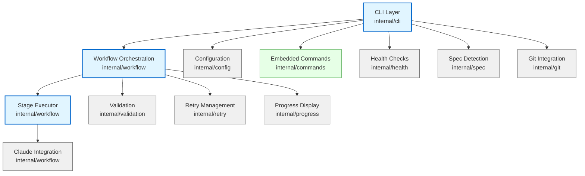
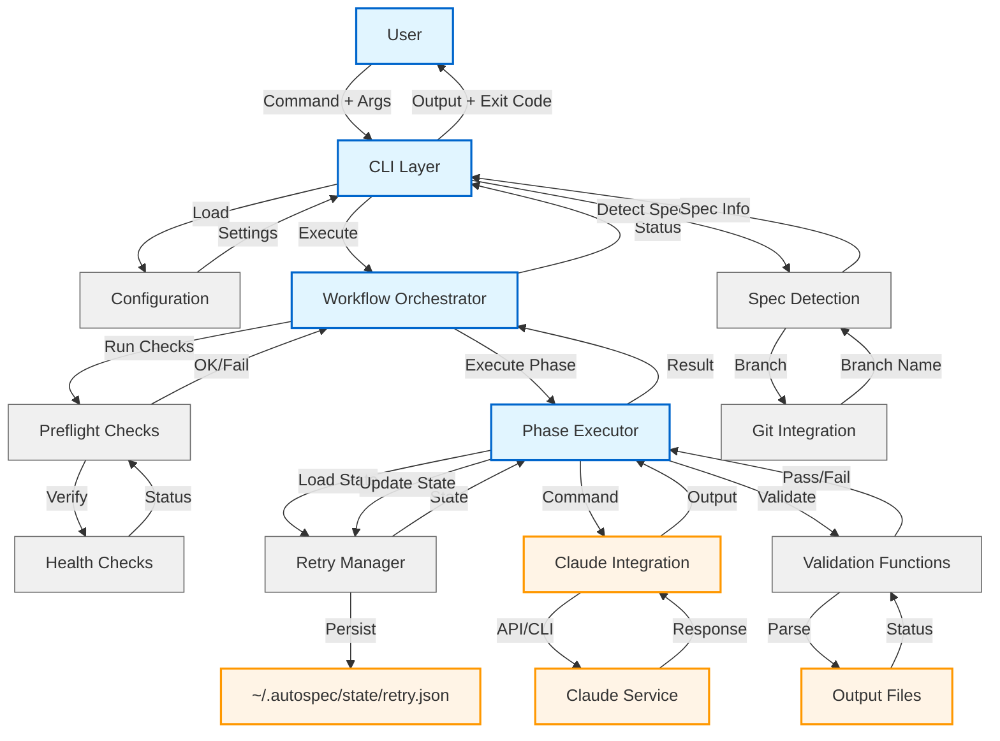
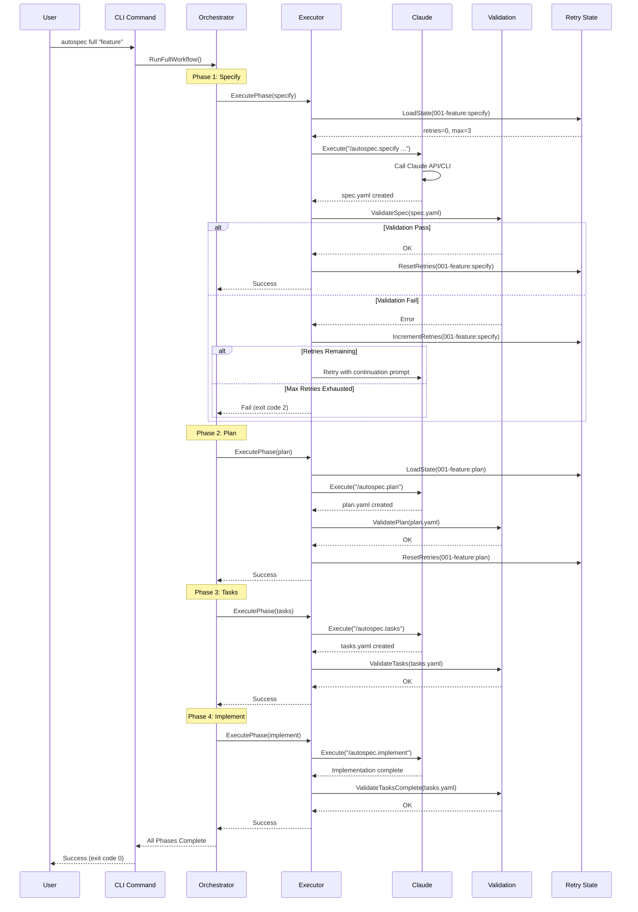
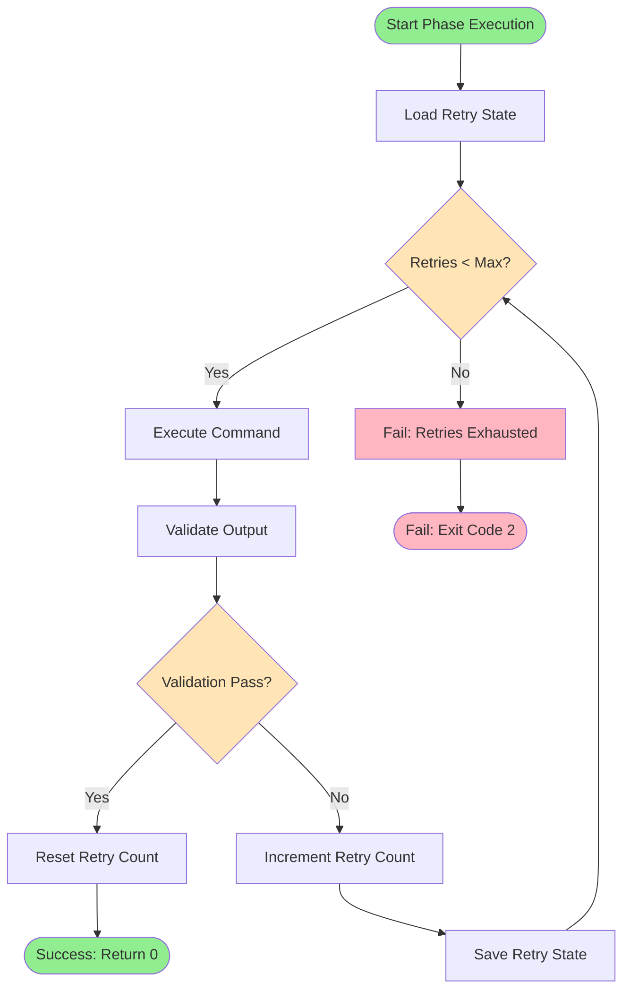

# Architecture Overview

Deep dive into autospec's system design, component structure, and execution patterns.

## Component overview

autospec is built as a modular Go application with clear separation of concerns across several packages.



### 1. CLI Layer (`internal/cli/`)

User-facing Cobra commands. Parse args, load config, invoke workflows, display results.

### 2. Workflow Orchestration (`internal/workflow/`)

Multi-stage execution with validation and retry. Execute stages in order, validate outputs, retry on failure.

### 3. Configuration (`internal/config/`)

Hierarchical config loading with koanf. Priority: Env > Local > Global > Defaults.

### 4. Validation (`internal/validation/`)

Fast validation (<10ms) for artifacts. Validate file existence, parse tasks, generate prompts.

### 5. Retry Management (`internal/retry/`)

Persistent retry state. Track retries per spec:phase in `~/.autospec/state/retry.json`.

### 6. Spec Detection (`internal/spec/`)

Auto-detect current spec. Check git branch pattern or most recent specs/ directory.

### 7. Git Integration (`internal/git/`)

Git helpers. Check repo status, get branch name.

### 8. Health Checks (`internal/health/`)

Dependency verification. Verify Claude CLI, check directory access, validate config.

### 9. Progress Display (`internal/progress/`)

Real-time feedback. Spinner indicators for long-running operations.

### 10. Embedded Commands (`internal/commands/`)

Slash command templates embedded in binary. Install to `.claude/commands/` during `autospec init`.

---

## System architecture

High-level architecture showing data flow and component interactions:



---

## Package structure

Internal package organization:

```
internal/
├── cli/          # Cobra CLI commands (root, run, all, prep, specify, plan, tasks,
│                 # implement, constitution, clarify, checklist, analyze, update_task,
│                 # update_agent_context, clean, uninstall, doctor, status, config, init, version)
├── workflow/     # WorkflowOrchestrator, Executor, ClaudeExecutor, PreflightChecks
├── config/       # Config loading (koanf), defaults, XDG paths, YAML validation
├── commands/     # Embedded slash command templates (.md files)
├── validation/   # File validation, task parsing, prompt generation
├── retry/        # Persistent retry state management
├── spec/         # Spec detection (git branch, directory scan)
├── git/          # Git helpers (branch name, repo status)
├── agent/        # Agent context file management (update CLAUDE.md, etc.)
├── health/       # Dependency verification
├── progress/     # Spinner display for operations
├── yaml/         # YAML parsing utilities
├── clean/        # Project cleanup functions
├── uninstall/    # System uninstall functions
└── errors/       # Custom error types
```

---

## Execution flow

### Complete workflow execution

Sequence diagram showing full workflow execution with retry logic:



### Phase execution with retry

Detailed flowchart showing retry logic within a single phase:



---

## Key patterns

### 1. Retry pattern

**How it works**:
```go
func (e *Executor) ExecutePhase(specName, phase, command string, validateFn func() error) error {
    state := e.retryManager.LoadState(specName, phase)

    for state.Count < state.MaxRetries {
        err := e.executeCommand(command)
        if err != nil {
            state.Count++
            e.retryManager.SaveState(state)
            continue
        }

        err = validateFn()
        if err == nil {
            e.retryManager.ResetRetries(specName, phase)
            return nil
        }

        state.Count++
        e.retryManager.SaveState(state)
    }

    return ErrRetriesExhausted
}
```

**Benefits**:
- Resilient to transient failures
- Persistent state across executions
- Configurable retry limits
- Clear failure reporting

### 2. Configuration layering

**Priority Order**:
1. Environment variables (`AUTOSPEC_*`)
2. Local config (`.autospec/config.yml`)
3. Global config (`~/.config/autospec/config.yml`)
4. Defaults (hardcoded)

**Example**:
```bash
# Priority 1: Environment variable
export AUTOSPEC_MAX_RETRIES=5

# Priority 2: Local config
echo 'max_retries: 0' > .autospec/config.yml

# Priority 3: Global config
echo 'max_retries: 2' > ~/.config/autospec/config.yml

# Result: max_retries = 5 (environment wins)
```

### 3. Spec detection

**Strategy**:
```go
func DetectCurrentSpec() (*SpecMetadata, error) {
    // Strategy 1: Git branch name
    branch := git.CurrentBranch()
    if matches := specPattern.FindStringSubmatch(branch); matches != nil {
        return parseSpecFromBranch(matches), nil
    }

    // Strategy 2: Most recent specs/ directory
    dirs := findSpecDirs("./specs")
    mostRecent := sortByModTime(dirs)[0]
    return parseSpecFromDir(mostRecent), nil
}
```

**Benefits**:
- Zero friction for users
- Works with git workflows
- Falls back to directory scan

### 4. Exit code conventions

All commands follow consistent exit codes:

| Code | Meaning | When Used |
|------|---------|-----------|
| 0 | Success | All operations completed successfully |
| 1 | Validation failed | Output artifact validation failed (retryable) |
| 2 | Retry limit exhausted | Max retries reached without success |
| 3 | Invalid arguments | User provided invalid command arguments |
| 4 | Missing dependencies | Required dependencies (claude, git) not found |
| 5 | Command timeout | Operation exceeded configured timeout |

**Benefits**:
- Scriptable workflows
- CI/CD integration
- Clear error identification

---

## Integration points

### Claude integration

**Methods**:
1. **CLI Mode** (default): Execute `claude` command via shell
2. **Custom Mode**: User-defined command with `{{PROMPT}}` placeholder

**Configuration**:
```yaml
claude_cmd: claude
custom_claude_cmd: "claude -p {{PROMPT}} | process-output"
```

**Prompt Injection**: All phase commands support optional guidance text:
```bash
autospec plan "Focus on security best practices"
# Executes: claude -p "/autospec.plan \"Focus on security best practices\""
```

### File system

**Directories**:
- `./specs/NNN-feature-name/`: Feature specifications and artifacts
- `~/.config/autospec/`: Global configuration (XDG compliant)
- `~/.autospec/state/`: State directory
- `.autospec/`: Local project configuration

**Files**:
- `spec.yaml`: Feature specification
- `plan.yaml`: Technical plan
- `tasks.yaml`: Task breakdown
- `~/.config/autospec/config.yml`: Global configuration
- `.autospec/config.yml`: Local configuration
- `~/.autospec/state/retry.json`: Retry state

### External tools

**Required**:
- Claude CLI: For workflow execution
- Git (optional): For branch-based spec detection

---

## Performance characteristics

**Design Goals**:
- Sub-second validation checks (<1s)
- Validation functions <10ms
- Minimal memory footprint
- Fast startup time

**Benchmarks**:
- File validation: ~1-2ms
- Task parsing: ~5-8ms
- Config loading: ~10-15ms

---

## Error handling

**Philosophy**: Fail fast, fail clearly, provide actionable guidance

**Patterns**:
1. **Validation Errors**: Include file paths, expected vs actual, retry suggestions
2. **Dependency Errors**: Include installation/fix instructions
3. **Timeout Errors**: Include timeout duration, config hints
4. **Retry Exhausted**: Include last error, retry count, state file location

**Example**:
```
Error: Validation failed: spec file not found
Expected: specs/001-dark-mode/spec.yaml
Retry: 2/3 (state: ~/.autospec/state/retry.json)
Hint: Run 'autospec specify "feature description"' to create spec
```

---

## Extension points

Areas designed for future extension:

1. **Custom Validators**: Add new validation functions in `internal/validation/`
2. **Additional Commands**: Add new CLI commands in `internal/cli/`
3. **Alternative Executors**: Implement ClaudeExecutor interface for new backends
4. **Custom Health Checks**: Extend health check framework
5. **Progress Reporters**: Implement alternative progress display formats

---

## Next Steps

- [Internals Guide](internals) - Deep dive into spec detection, validation, and retry systems
- [CLI Reference](/autospec/reference/cli) - Complete command documentation
- [YAML Schemas](/autospec/reference/yaml-schemas) - Artifact structure and validation
